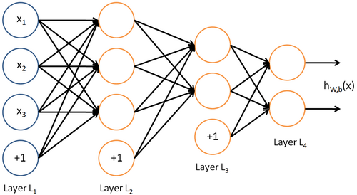
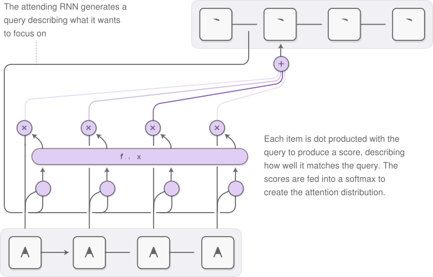
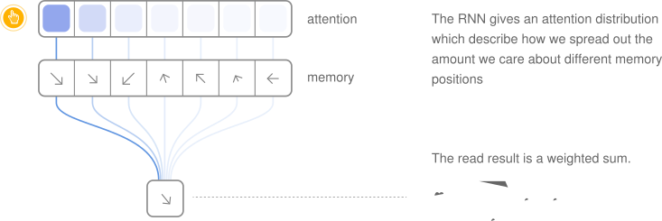
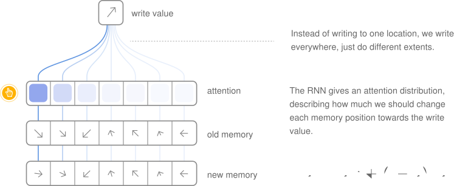
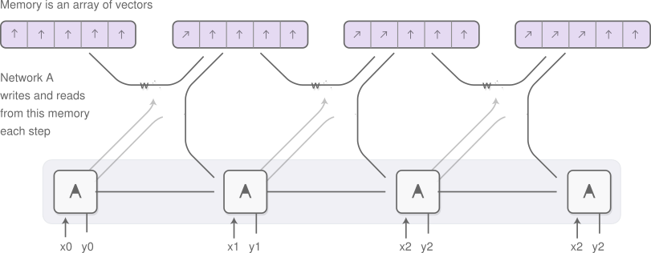

# Deep Learning

### From Programming Computers,
### To Training Them,
### To Training Them to Program Themselves

---

# A Primer
1. Artificial Intelligence
2. Machine Learning
3. Deep Learning

---

# Artificial Intelligence

## Human Intelligence Exhibited by Machines

* machines possessing the characteristics of human intelligence
* machines that have all our senses, all our reason, and think just like we do

---

# Machine Learning

## An Approach to Achieve Artificial Intelligence

* no hand-coded software routines with a specific set of instructions to accomplish a particular task
* 'trained' using large amounts of data and algorithms that give it the ability to learn how to perform the task

---

# Deep Learning

## A Technique for Implementing Machine Learning

* learning representations and transformations of data using neural networks
* based on the biological brain, but unlike it, they have discrete layers, connections, and directions of data propagation
* in essence, functions $f$ controlled by the set of parameters $\theta$ controlling transformations between hyperspaces $\Re^p$ and $\Re^q$, ie. $f_\theta : \Re^p \to \Re^q$
* it's all about finding the right parameters

---

# Part 1: Basic Concepts
# Part 2: Advanced Ideas

---

# Part 1: Basic Concepts
## Building Neural Networks
## Training Neural Networks

---

# Building Neural Networks

1. Neurons: The Fundamental Building Blocks
2. Layers and Networks: Building Architectures Bottom Up

---

## Neurons

* biological neuron receives impulses from other neurons, is excited by them to an extent, and subsequently generates a response
* mathematical neuron accepts a vector of inputs, and runs its weighted sum through a thresholding function
* in effect, applies a nonlinear map to an affine transform, $h_{w,b}: \Re^p \to \Re$.

	

$$h_{w,b}(x) = \frac{1}{1 + e^{-(\Sigma^{p}_{i = 1} w_i \cdot x_i + b)}}$$

---

## Layers and Networks

* stack of $q$ neurons forms a layer, each with their own parameters
* neural layer maps $h_{W,b}: \Re^p \to \Re^q$
* connecting layers by feeding the outputs of one layer to the inputs of the next forms a neural network

	

$$h_{W,b}(x)=\sigma_3(W_3\cdot\sigma_2(W_2\cdot\sigma_1(W_1\cdot x+b_1)+b_2)+b_3)$$

---

# Training Neural Networks
1. Supervised Learning: Making Function Approximators
2. Unsupervised Learning: Making Feature Extractors
3. Gradient Descent: Optimizing Parameters
4. Backpropagation: The Learning Algorithm

---

# Supervised Learning

* set consists of pairs of inputs and expected outputs
* looks like $\{(x_i, y_i)\ |\ i \in [1,n], x_i \in \Re^p, y_i \in \Re^q \ \forall\ i\}$
* networks learn a mapping such that $f_\theta (x_i) \approx y_i\ \forall\ i$
* we choose a set of parameters $\theta^\star$ which minimizes a cost function $||: \Re^q \times \Re^q \to \Re$ as $\theta^\star = argmin_\theta \Sigma^{n}_{i = 1}| f_\theta(x_i), y_i|$

---

# Unsupervised Learning

* set consists of inputs alone
* looks like $\{x_i\ |\ i \in [1,n], x_i \in \Re^p\ \forall\ i\}$
* learn a $q$ dimensional representation of the $p$ dimensional data
* autoencoders often define a $2^{nd}$ reconstruction function $g_\phi: \Re^q \to \Re^p$ to approximate $g_\phi(f_\theta(x_i)) \approx x_i\ \forall\ i$

---

# Gradient Descent

* trying to change the parameters to minimize the cost function, by moving the parameters by a small amount in the direction in which the cost decreases the most
* assume the cost function is differentiable with respect to the parameters
* repeat $\theta\leftarrow\theta-\alpha\cdot \nabla_\theta|f_\theta(x),y|$ until convergence
* batch gradient descent takes a step for the entire dataset
* stochastic gradient descent takes a step for each training sample

---

# Backpropagation

* forward pass applies each layers map sequentially to the input
* for an $n$-layer network, $x_{i + 1}$ is a function of $x_i$ and $\theta_i$, alone
* backpropagation feeds the gradients backwards through the layers, in the reverse order, to propagate the derivative of the cost funciton, and calculate the derivatives with respect to the parameters in each layer from it
* to convert the partial derivatives of a function, $f$, with respect to the system $x_{n + 1}$ into the those with respect to the system $x_n$, we use the Jacobian as $\frac{\partial f}{\partial x_n} = \frac{\partial (x_{n + 1}^{(1)}...x_{n + 1}^{(q)})}{\partial (x_n^{(1)}...x_n^{(p)})}^T \cdot \frac{\partial f}{\partial x_{n + 1}}$

---

# Part 2: Advanced Ideas
## Recurrent Models
## Programming Models

---

# Recurrent Models
1. Persistance: Remembering The Last Time
2. Unrolling Time: The Other Dimension
3. Long Short Term Memory: Remembering The First Time
4. Attention: Knowing Where To Look

---

# Persistance

* develop a form of persistant memory
* the flow of data through neurons must contain cycles, whereby neurons can pass themselves information later
* recurrences are implemented by passing hidden state vectors through timesteps
* outputs and the next state are a function of the current state and inputs

	

---

# Unrolling Time

* recurrence dynamics: unroll the network in time
* replicate the nonrecurrent connections once for each timestep
* then add the recurrent connections between adjacent copies of the network
* recurrences provide inputs to their target while feeding forward, and derivatives to their source while backpropagating

	

---

# Long Short Term Memory

* in vanilla recurrent networks, the gradients explode or vanish
* LSTM has the ability to remove or add information to the cell state, carefully regulated by structures called gates
* the input, forget and output gates determine how much history to throw away, how much input to keep and how much to output

	

---

# Attention

* focusing on a small part of the information at each timestep
* must be differentiable, so that we can learn where to focus
* we focus everywhere, to different extents

	

---

# Programming Models
1. Reading Mechanisms
2. Writing Mechanisms
3. Neural Turing Machines
4. Neural Programmer Interpreters
5. Differentiable Neural Computers

---

# Reading Mechanisms

	

---

# Writing Mechanisms

	

---

# Neural Turing Machines

	

---

# Neural Programmer Interpreters

	

---

# Differentiable Neural Computers

	<video width="640" height="480" autoplay >
		<source src="res/dnc.mp4" type="video/mp4">
	</video> 

---

# An Epilogue
1. Acknowledgements
2. References

---

# Acknowledgements

* [Unsupervised Feature Learning and Deep Learning](http://ufldl.stanford.edu/wiki/index.php/Neural_Networks)
	Neurons, Layers and Networks

* [Colah's Blog](http://colah.github.io/posts/2015-08-Understanding-LSTMs/)
	Persistance, Unrolling Time, Long Short Term Memory

* [Distill Blog](http://distill.pub/2016/augmented-rnns/)
	Attention, Reading Mechanisms, Writing Mechanisms, Neural Turing Machines

* [University of Michigan](http://www-personal.umich.edu/~reedscot/iclr_project.html)
	Neural Programmer Interpreters

* [Google DeepMind](https://deepmind.com/blog/differentiable-neural-computers/)
	Differentiable Neural Computers

---

# References

* [Long Short-Term Memory](http://deeplearning.cs.cmu.edu/pdfs/Hochreiter97_lstm.pdf)

* [Neural Turing Machines](https://arxiv.org/abs/1410.5401)

* [Neural Programmer Interpreters](https://arxiv.org/abs/1511.06279)

* [Hybrid Computing Using A Neural Network With Dynamic External Memory](http://www.nature.com/nature/journal/v538/n7626/full/nature20101.html)