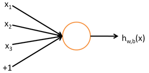
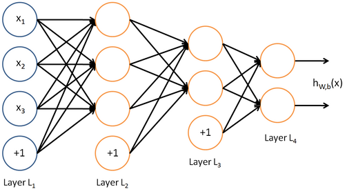
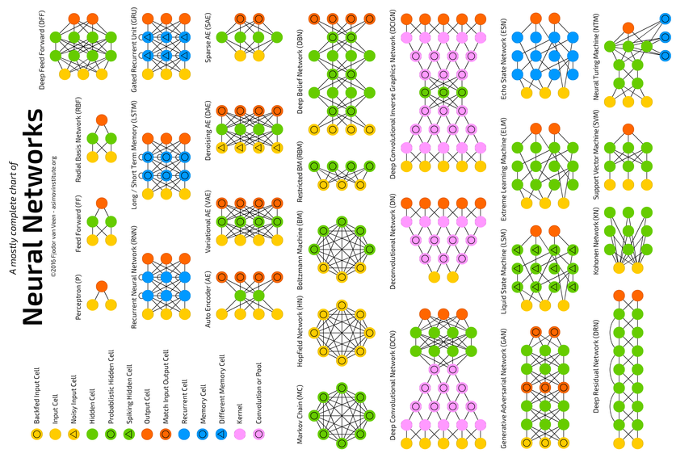
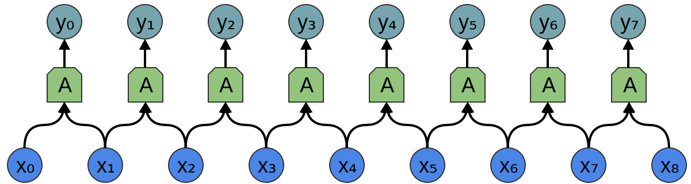
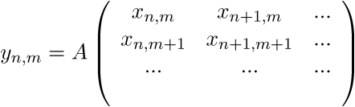
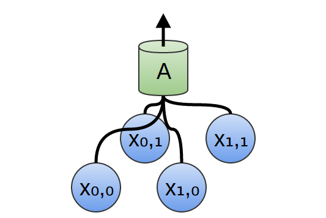
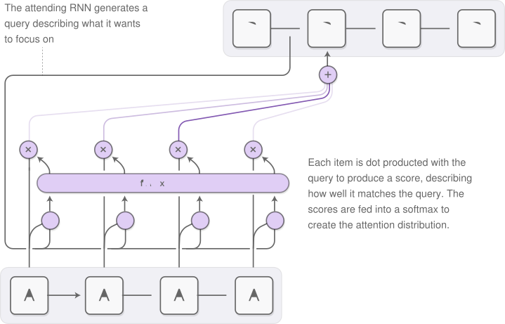
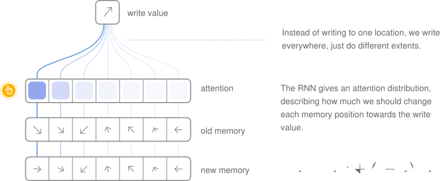
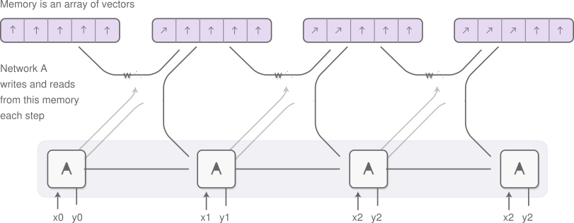

# Deep Learning

### The Answer to
### The Ultimate Question of Life,
### The Universe, and Everything?

---

# A Teaser

1. Text
	* Logic and Reasoning
	* Conversational Models

2. Images
	* Image Captioning
	* Style Transfer

3. Games
	* Deep Reinforcement Learning

---

# Logic and Reasoning

	<video width="640" height="480" autoplay >
		<source src="../161121/res/dnc.mp4" type="video/mp4">
	</video>

---

# Conversational Models

* Human: what is the color of the sky?
	* Machine: blue.
* Human: what is the color of water?
	* Machine: water.
...
* Human: what is the purpose of life?
	* Machine: to serve the greater good.
* Human: what is the purpose of living?
	* Machine: to live forever.
...
* Human: what do you think about tesla ?
	* Machine: he's a good conductor.

---

# Image Captioning

	

---

# Style Transfer

	

---

# Deep Reinforcement Learning 1

	<video width="640" height="480" autoplay >
		<source src="res/mario.mp4" type="video/mp4">
	</video>

---

# Deep Reinforcement Learning 2

	<video width="640" height="480" autoplay >
		<source src="res/gtav.mp4" type="video/mp4">
	</video>

---

# A Primer
1. Artificial Intelligence
2. Machine Learning
3. Deep Learning

---

# Artificial Intelligence

## Human Intelligence Exhibited by Machines

* machines possessing the characteristics of human intelligence
* machines that have all our senses, all our reason, and think just like we do

---

# Machine Learning

## An Approach to Achieve Artificial Intelligence

* no hand-coded software routines with a specific set of instructions to accomplish a particular task
* 'trained' using large amounts of data and algorithms that give it the ability to learn how to perform the task

---

# Deep Learning

## A Technique for Implementing Machine Learning

* learning representations and transformations of data using neural networks
* based on the biological brain, but unlike it, they have discrete layers, connections, and directions of data propagation
* in essence, functions $f$ controlled by the set of parameters $\theta$ controlling transformations between hyperspaces $\Re^p$ and $\Re^q$, ie. $f_\theta : \Re^p \to \Re^q$
* it's all about finding the right parameters

---

# Part 1: Basic Concepts
# Part 2: Intermediate Theory
# Part 3: Advanced Ideas

---

# Part 1: Basic Concepts
## Building Neural Networks
## Training Neural Networks

---

# Building Neural Networks

1. Neurons: The Fundamental Building Blocks
2. Layers and Networks: Building Architectures Bottom Up

---

## Neurons

* biological neuron receives impulses from other neurons, is excited by them to an extent, and subsequently generates a response
* mathematical neuron accepts a vector of inputs, and runs its weighted sum through a thresholding function
* in effect, applies a nonlinear map to an affine transform, $h_{w,b}: \Re^p \to \Re$.

	

$$h_{w,b}(x) = \frac{1}{1 + e^{-(\Sigma^{p}_{i = 1} w_i \cdot x_i + b)}}$$

---

## Layers and Networks

* stack of $q$ neurons forms a layer, each with their own parameters
* neural layer maps $h_{W,b}: \Re^p \to \Re^q$
* connecting layers by feeding the outputs of one layer to the inputs of the next forms a neural network

	

$$h_{W,b}(x)=\sigma_3(W_3\cdot\sigma_2(W_2\cdot\sigma_1(W_1\cdot x+b_1)+b_2)+b_3)$$

---

# Training Neural Networks
1. Supervised Learning: Making Function Approximators
2. Unsupervised Learning: Making Feature Extractors
3. Gradient Descent: Optimizing Parameters
4. Backpropagation: The Learning Algorithm

---

# Supervised Learning

* set consists of pairs of inputs and expected outputs
* looks like $\{(x_i, y_i)\ |\ i \in [1,n], x_i \in \Re^p, y_i \in \Re^q \ \forall\ i\}$
* networks learn a mapping such that $f_\theta (x_i) \approx y_i\ \forall\ i$
* we choose a set of parameters $\theta^\star$ which minimizes a cost function $||: \Re^q \times \Re^q \to \Re$ as $\theta^\star = argmin_\theta \Sigma^{n}_{i = 1}| f_\theta(x_i), y_i|$

---

# Unsupervised Learning

* set consists of inputs alone
* looks like $\{x_i\ |\ i \in [1,n], x_i \in \Re^p\ \forall\ i\}$
* learn a $q$ dimensional representation of the $p$ dimensional data
* autoencoders often define a $2^{nd}$ reconstruction function $g_\phi: \Re^q \to \Re^p$ to approximate $g_\phi(f_\theta(x_i)) \approx x_i\ \forall\ i$

---

# Gradient Descent

* trying to change the parameters to minimize the cost function, by moving the parameters by a small amount in the direction in which the cost decreases the most
* assume the cost function is differentiable with respect to the parameters
* repeat $\theta\leftarrow\theta-\alpha\cdot \nabla_\theta|f_\theta(x),y|$ until convergence
* batch gradient descent takes a step for the entire dataset: true cost derivative, but slow to compute
* stochastic gradient descent takes a step for each training sample: noisy estimate, but works well in practice

---

# Backpropagation

* forward pass applies each layers map sequentially to the input
* for an $n$-layer network, $x_{i + 1}$ is a function of $x_i$ and $\theta_i$, alone
* backpropagation feeds the gradients backwards through the layers, in the reverse order, to propagate the derivative of the cost funciton, and calculate the derivatives with respect to the parameters in each layer from it
* to convert the partial derivatives of a function, $f$, with respect to the system $x_{n + 1}$ into the those with respect to the system $x_n$, we use the Jacobian as $\frac{\partial f}{\partial x_n} = \frac{\partial (x_{n + 1}^{(1)}...x_{n + 1}^{(q)})}{\partial (x_n^{(1)}...x_n^{(p)})}^T \cdot \frac{\partial f}{\partial x_{n + 1}}$

---

# Part 2: Intermediate Ideas
## Theoretical Functions
## Real Functions

---

# Theoretical Functions
1. Universality Theorem and Smoothness Prior: The Good
2. Curse of Dimensionality: The Bad
3. High Dimensional Local Minima: The Ugly

---

# Universality Theorem

* single hidden layer neural networks can approximate any arbitrary function to any desired accuracy
* given 'enough' hidden units

# Smoothness Prior

* inputs 'close' to each other map to outputs 'close' to each other
* this makes sense for supervised learning
* does not help deep learning much, which relies heavily on unsupervised feature extraction.

---

# Curse of Dimensionality

* given too many criteria to consider, a model shall never see enough examples of all combinations to form general decision strategies
* state of the art deep learning 'is akin to building a rocket ship. You need a huge engine and a lot of fuel. If you have a large engine and a tiny amount of fuel, you won't make it to orbit. If you have a tiny engine and a ton of fuel, you can't even lift off.'
* rocket engine is the deep learning models
* fuel is the huge amounts of data we can feed them

---

# High Dimensional Local Minima

* gradient descent does not allow one to backtrack
* gradient descent does not allow one to make stochastic upward transitions
* neural networks are sensitive to initialization, and saturation
* high dimensional spaces tend to be counterintuitive
* there are several equally good global minima
* most local minima are close to the global minima

---

# Real Functions
1. Overfitting: Getting Too Good Is Bad
2. Regularization: Don't Be Biased
3. Dataset Augmentation and Bagging: Opinions Matter
4. Dropout: Don't Always Give It 100%
5. Cross Validation: Be Certain

---

# Overfitting

* real functions are noisy
* network may not learn at all
* network may fit even the noise in training data, and fail to generalize to unseen samples

	

---

# Regulatization

* adds a norm of the parameters to the cost being optimized
* prevents them from growing unnecessarily to accommodate small variations
* if the parameters be $\theta_i$, then
* $\mathcal{L}_1(\theta)$ regularization adds $\lambda \cdot \sum_i |\theta_i|$ to the cost
* $\mathcal{L}_2(\theta)$ regularization adds $\lambda \cdot \sum_i \theta_i^2$ to the cost
* sparse representations add a penalty $\lambda \cdot \sum_i |a_i|$, for the activation of the neurons $a_i$

---

# Dataset Augmentation

* generating new samples from the existing data for small datasets
* by adding noise with infinitesimal variance to the inputs
* the introduction of noise serves as a strong regularizer
* may be added to the inputs, activations, parameters, or outputs.

# Bagging

* bagging or other ensemble methods use a number of distinct networks
* predictions are averaged to generate results on the testing set
* different models will usually not make the same errors on the testing set

---

# Dropout

* dropout trains an ensemble consisting of all subnetworks that can be constructed by removing nonoutput units from an underlying base network
* during training, each neuron has a probability $p$ of being in the network
* during testing, each neuron generates only $p$ of its activation as output

	

---

# Cross Validation

* divide the dataset into training, validation, and testing sets
* training set is used to tune the parameters by backpropagation
* validation set is used to tune the hyperparameters during training, and indicates the error on unseen samples
* since we select the network resulting in the lowest validation error, it would be questionable to present this as our final result
* testing set measures the error on generalizing to arbitrary input data

---

# Part 3: Advanced Models
## Spoilt For Choice
## Word Vector Models
## Convolutional Models
## Recurrent Models
## Programming Models

---

# Spoilt For Choice

	

---

# Word Vector Models
1. Continuous Bag of Words and Skip Grams: Knowing a Word by the Company it Keeps
2. Linear Semantic Relationships: King - Man + Woman = Queen

---

# Continuous Bag of Words and Skip Grams

* continuous bags model the centre word given the context
* skip grams model the context given the centre word

	

---

# Linear Semantic Relationships

* it is possible to do basic arithmetic on words

	

---

# Convolutional Models
1. Convolutions: Feature Detectors
2. Symmetries: Feature Manifestations

---

# Convolutions

* using many identical copies of the same neuron
* allows networks to have lots of neurons and express computationally large models
* keeps number of actual parameters to be learned small

	

$$y_n=A\left(\begin{array}{}x_n&x_{n+1}&...\end{array}\right)$$

---

# Symmetries

* exploits symmetry in properties, useful to look for in the data
* these are local: we only need to look at a small window of the input in order to determine them
* extended in 2 dimensions on images to exploit spatial coherence

	
	

---

# Recurrent Models
1. Persistance: Remembering The Last Time
2. Unrolling Time: The Other Dimension
3. Long Short Term Memory: Remembering The First Time
4. Attention: Knowing Where To Look

---

# Persistance

* develop a form of persistant memory
* the flow of data through neurons must contain cycles, whereby neurons can pass themselves information later
* recurrences are implemented by passing hidden state vectors through timesteps
* outputs and the next state are a function of the current state and inputs

	

---

# Unrolling Time

* recurrence dynamics: unroll the network in time
* replicate the nonrecurrent connections once for each timestep
* then add the recurrent connections between adjacent copies of the network
* recurrences provide inputs to their target while feeding forward, and derivatives to their source while backpropagating

	

---

# Long Short Term Memory

* in vanilla recurrent networks, the gradients explode or vanish
* LSTM has the ability to remove or add information to the cell state, carefully regulated by structures called gates
* the input, forget and output gates determine how much history to throw away, how much input to keep and how much to output

	

---

# Attention

* focusing on a small part of the information at each timestep
* must be differentiable, so that we can learn where to focus
* we focus everywhere, to different extents

	

---

# Programming Models
1. Reading Mechanisms
2. Writing Mechanisms
3. Neural Turing Machines

---

# Reading Mechanisms

	

---

# Writing Mechanisms

	

---

# Neural Turing Machines

	

---

# An Epilogue
1. Practising What I Preached
2. Acknowledgements
3. References

---

# Practising What I Preached

[Tensorflow Playground](http://playground.tensorflow.org/)

---

# Acknowledgements

* [Google DeepMind](https://deepmind.com/blog/differentiable-neural-computers/): Logic and Reasoning
* [Andrej Karpathy](http://cs.stanford.edu/people/karpathy/deepimagesent/): Image Captioning
* [Prisma](http://prisma-ai.com/og-image.jpg): Style Transfer
* [Alexander Jung](https://github.com/aleju/mario-ai): Deep Reinforcement Learning 1
* [Open AI](https://openai.com/blog/GTA-V-plus-Universe/): Deep Reinforcement Learning 2
* [Unsupervised Feature Learning and Deep Learning](http://ufldl.stanford.edu/wiki/index.php/Neural_Networks): Neurons, Layers and Networks
* [Tensorflow Tutorials](https://www.tensorflow.org/tutorials/word2vec/): Linear Semantic Relationships
* [Colah's Blog](http://colah.github.io/posts/2015-08-Understanding-LSTMs/): Persistance, Unrolling Time, Long Short Term Memory
* [Distill Blog](http://distill.pub/2016/augmented-rnns/): Attention, Reading Mechanisms, Writing Mechanisms, Neural Turing Machines
* [University of Michigan](http://www-personal.umich.edu/~reedscot/iclr_project.html): Neural Programmer Interpreters

---

# References

* [Hybrid Computing Using A Neural Network With Dynamic External Memory](http://www.nature.com/nature/journal/v538/n7626/full/nature20101.html)
* [A Neural Conversational Model](https://arxiv.org/abs/1506.05869)
* [A Neural Algorithm of Artistic Style](https://arxiv.org/abs/1508.06576)
* [Deep Visual-Semantic Alignments for Generating Image Descriptions](http://cs.stanford.edu/people/karpathy/cvpr2015.pdf)
* [Human-level control through deep reinforcement
learning](https://storage.googleapis.com/deepmind-media/dqn/DQNNaturePaper.pdf)
* [Efficient Estimation of Word Representations in Vector Space](https://arxiv.org/abs/1301.3781)
* [Object Recognition with Gradient-Based Learning](http://yann.lecun.com/exdb/publis/pdf/lecun-99.pdf)
* [Long Short-Term Memory](http://deeplearning.cs.cmu.edu/pdfs/Hochreiter97_lstm.pdf)
* [Neural Turing Machines](https://arxiv.org/abs/1410.5401)