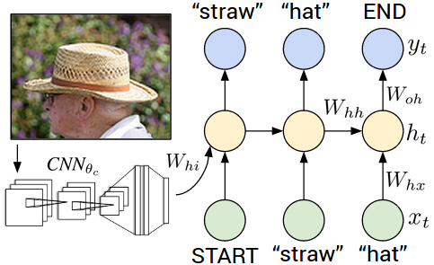
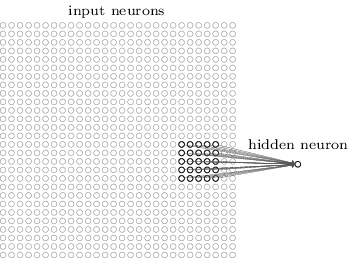
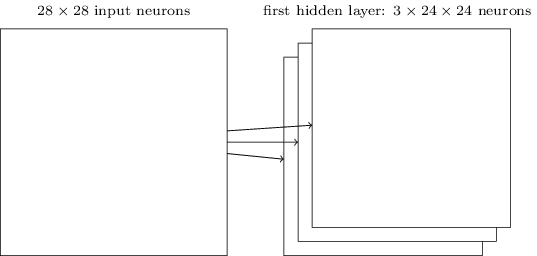
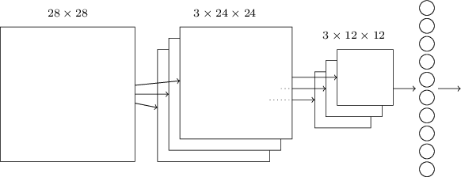

# A Picture is Worth a Thousand Words

### But Describing Pictures
### Ain't Easy

---

# Classifying, Captioning, Describing

	

---

# Classification

	

5041

---

# Image Vectors

	

---

# Fully Connected Neural Networks

	

---

# Fully Connected Neural Networks

	

---

# Fully Connected Neural Networks

	

---

# Captioning

	

---

# Convolutional Neural Networks

	

---

# Convolutional Neural Networks

	

---

# Convolutional Neural Networks

	

---

# Convolutional Neural Networks

	

---

# Convolutional Neural Networks

	

---

# Convolutional Neural Networks

	

---

# Convolutional Neural Networks

	

---

# Convolutional Neural Networks

	

---

# Convolutional Neural Networks

	

---

# Recurrent Neural Networks

	

---

# Dense Captioning

	

---

# Region Proposal Networks

	

---

# Acknowledgements

* [Andrej Karpathy](http://cs.stanford.edu/people/karpathy/) Classifying, Captioning and Describing
* [Tensorflow](https://www.tensorflow.org/tutorials/mnist/beginners/) Classification, Image Vectors
* [Michael Nielsen](http://neuralnetworksanddeeplearning.com/chap1.html) Fully Connected Neural Networks
* [Andrej Karpathy](http://cs.stanford.edu/people/karpathy/) Captioning
* [Michael Nielsen](http://neuralnetworksanddeeplearning.com/chap6.html) Convolutional Neural Networks
* [WildML](http://www.wildml.com/2015/09/recurrent-neural-networks-tutorial-part-1-introduction-to-rnns/) Recurrent Neural Networks
* [Andrej Karpathy](http://cs.stanford.edu/people/karpathy/deepimagesent/): Dense Captioning
* [Justin Johnson](http://cs.stanford.edu/people/ranjaykrishna/im2p/index.html) Region Proposal Networks